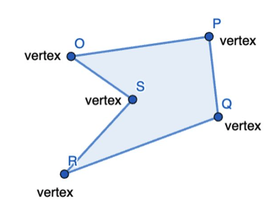

# Líneas y Polígonos
Semestre 02, 2025


## Introducción


### Objetivos de la clase

- Comprender cómo se representan **líneas** en un raster.
- Aprender el **Algoritmo de Bresenham** para el trazado eficiente de líneas.
- Aplicar conceptos para dibujar **polígonos**.
- Discutir implicaciones de **precisión** y **eficiencia** en gráficos computacionales.


## Líneas


### El reto de dibujar una línea


Una línea ideal es una figura **geométrica infinita** en matemáticas.


En la pantalla, tenemos una **malla de píxeles discretos**.


Necesitamos aproximar la línea con los **píxeles más cercanos**.


## Algoritmos


### Ecuación de la línea:
  \( y = mx + b \)
  - Simple pero requiere operaciones de punto flotante (caro).
  - Problema: redondeo en cada paso.


### DDA (Digital Differential Analyzer)
- Incrementos fraccionales:
  - Paso a paso en X, calculamos Y.
- Mejor que la ecuación directa.
- Problema: aún usa flotantes y es **costoso** para hardware limitado.


## Bresenham’s Line Algorithm


### Ventajas

- Solo operaciones con **enteros**  
- Uso eficiente de la memoria y CPU  
- Perfecto para **hardware antiguo** y aún relevante hoy.


### Concepto

- Recorremos el eje dominante (X o Y).
- En cada paso decidimos:
  - ¿El siguiente píxel está **en la misma fila** o debemos **subir/bajar una fila**?
- Usamos un **error acumulado** para tomar decisiones.


### Paso a paso


$$
\Delta x = x_1 - x_0
$$

$$
\Delta y = y_1 - y_0
$$

$$
err = 2 \cdot \Delta y - \Delta x
$$


$$
\textbf{Para cada paso en X:}
$$

$$
\text{Si } err \ge 0,\ \text{avanza } Y\ \text{y ajusta el error}
$$

$$
\text{Si no, solo avanza en } X
$$


### Pseudocódigo


```python[]
def draw_line(x0, y0, x1, y1):
    dx = abs(x1 - x0)
    sx = 1 if x0 < x1 else -1
    dy = -abs(y1 - y0)
    sy = 1 if y0 < y1 else -1
    err = dx + dy  # error acumulado

    while True:
        plot(x0, y0)

        if x0 == x1 and y0 == y1:
            break

        e2 = 2 * err

        if e2 >= dy:
            err += dy
            x0 += sx

        if e2 <= dx:
            err += dx
            y0 += sy
```


### Ejemplo


### Línea de (2, 3) → (8, 5)

$$
dx = |8 - 2| = 6
$$

$$
dy = -|5 - 3| = -2
$$

$$
err = dx + (-dy) = 6 + (-2) = 4
$$

$$
sx = +1,\ sy = +1
$$


| Paso | (x, y)  | err | e2  |
|------|---------|-----|-----|
| 1    | (2, 3)  | 4   | 8   |
| 2    | (3, 3)  | 2   | 4   |
| 3    | (4, 3)  | 0   | 0   |
| 4    | (5, 4)  | 4   | 8   |
| 5    | (6, 4)  | 2   | 4   |
| 6    | (7, 5)  | 6   | 12  |
| 7    | (8, 5)  | -   | -   |


## Polígonos


Figura cerrada formada por una secuencia de **líneas**.


Dos componentes principales:
  - **Vértices (puntos)**
  - **Aristas (segmentos entre vértices)**





### Dibujo

- Recibe un array de puntos:  
  `[(x₀, y₀), (x₁, y₁), ..., (xn, yn)]`
- Para cada par de puntos consecutivos, dibuja una línea.
- Conecta el último punto con el primero.


### Rellenado
- Rellenado:
  - Flood fill
  - Scanline fill

