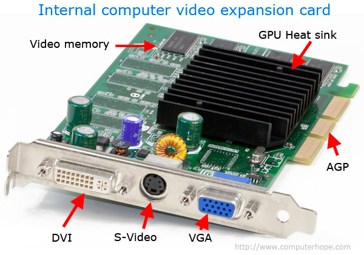

# Ventanas
Semestre 02, 2025


## Introducción


En la clase anterior, aprendieron a utilizar la memoria RAM para escribir un archivo de imagen. A este proceso le llamamos **renderizado estático**.


De ahora en adelante vamos a trabajar con **renderizado en tiempo real**.  


Lo que haremos es básicamente repetir el proceso de pintar, pero ahora dentro de un `while true` en una ventana.  


La idea es:  
- Pintar la pantalla.  
- Mostrarla.  
- Limpiarla y volver a pintar con ligeras modificaciones.  
Esto va a crear la **ilusión de movimiento**.


## Framebuffer y GPU


Su computadora tiene un solo framebuffer que funciona como aprendieron en el ejercicio anterior.  


Si tienen una **tarjeta de video (GPU)**, el framebuffer está en la memoria de video.  


Si no, el framebuffer está en la memoria RAM y es gestionado por la CPU.




La tarjeta de video tiene la interfaz directa con el monitor. Convierte los bytes del framebuffer en una señal eléctrica que el monitor puede entender y mostrar.  


Cuando hablamos de cables VGA, DVI, HDMI, etc., también hablamos de protocolos que la GPU usa para comunicarse con el monitor.


## ¿Quién escribe en la memoria de video?


Esto es trabajo del **driver de video**:  
- Nvidia usa CUDA.  
- AMD usa GCN.  
- Intel usa sus propias arquitecturas.  


El **driver** abstrae los detalles de hardware y expone APIs para que el sistema operativo gestione gráficos.


## Window System


El sistema operativo corre múltiples programas que quieren escribir en la pantalla al mismo tiempo.


Para pintar, las aplicación no necesita preocuparse por coordenadas absolutas.  
El Window System traduce las coordenadas relativas al framebuffer.


También provee una interfaz gráfica básica (ventanas, cursores, etc.).


### Problema
Los sistemas antiguos (como DOS) solo podían ejecutar un programa a la vez → no había conflicto.


Con multitasking, necesitamos un **Window System** para organizar:  

- Qué píxeles pertenecen a cada programa.
- Cuándo y cómo se deben dibujar.


### Ejemplo con X11 (Linux)

X11 actúa como servidor, las aplicaciones como clientes:  
- Firefox abre una ventana de 800x600.  
- X11 le asigna un área en el framebuffer.  
- Firefox pinta sus elementos en ese espacio.  

A esto lo llamamos una **ventana**.


## Window Manager y Compositor


Cliente especial dentro del Window System cuyo trabajo es controlar cómo se muestran las ventanas en la pantalla.


El **Window Manager** decide:  
- Posición y tamaño de la ventana.  
- Decoraciones (barra de título, botones). 
- Comportamiento cuando una ventana se maximiza, minimiza o mueve.


Para efectos más complejos (transparencia, animaciones), usamos un **compositor**.  


Ejemplos:  
- Linux: i3, GNOME Mutter, KWin.  
- macOS: Quartz Compositor.  
- Windows: Desktop Window Manager (DWM).


```sql
+-------------------------+
|      Window System      | <-- Ej: X11, Wayland
| +---------------------+ |
| |   Window Manager      | <-- Ej: i3, KWin, Mutter
| +---------------------+ |
| +---------------------+ |
| | Applications          |
| +---------------------+ |
+-------------------------+
```


## Window Toolkits


Bibliotecas que facilitan el desarrollo de interfaces gráficas al abstraer la complejidad de los Window Systems y Window Managers.


Permiten crear ventanas, botones, menús y controles sin preocuparse por el manejo directo del framebuffer o los eventos del sistema operativo.


Gestionan la comunicación con el Window System (X11, Wayland, Quartz, DWM) y hacen que tu código sea portable entre plataformas.