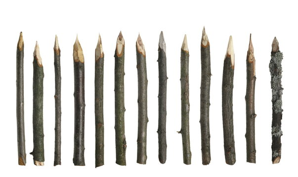

# Raycasting
Semestre 02, 2025


## Introducción


El Raycasting es una técnica fundamental para la simulación de escenas tridimensionales en entornos 2D.


Exploraremos el concepto de campo de visión (FOV), analizando cómo influye en la forma en que un observador percibe el entorno virtual.


## Raycasting


Raycasting es una técnica de proyección en la que se lanzan rayos desde un punto (usualmente el jugador) hacia el entorno.


Cada rayo verifica colisiones con objetos o paredes para determinar qué es visible y a qué distancia.


A diferencia de un motor 3D completo, el raycasting puede simular una perspectiva tridimensional usando operaciones 2D.


## Aplicaciones


Motores de juegos tempranos como Wolfenstein 3D (1992).


Motores de colisión simples para juegos y simulaciones.


Análisis de línea de visión en IA y juegos de estrategia.


## Proceso de Raycasting


1. Para cada columna vertical de la pantalla, se lanza un rayo.


2. Se calcula la intersección del rayo con el entorno (muro, obstáculo).


3. Se determina la distancia desde el jugador hasta el punto de intersección.


4. Se calcula la altura de la "pared" a dibujar con base en esa distancia (cuanto más lejos, más pequeña).


5. Se dibuja la columna con una textura o color correspondiente.


## ¿Cómo podemos mostrar lo que el jugador está viendo?


Actualmente, un solo rayo nos da información únicamente de lo que hay directamente al frente. ¿Cómo representar todo el campo de visión?


A este concepto le llamamos **field of view**.


## Campo de Visón (FOV)


Podemos visualizar el campo de visión como la dirección hacia donde el jugador está mirando. 


Para simplificar los cálculos, se usa una medida en radianes, como $\frac{\pi}{3}$.


Simulamos un "rayo" que parte desde el jugador y se mueve en línea recta en la dirección del ángulo hasta encontrar una pared.


FOV bajo: mayor "zoom", menor percepción de periferia.


FOV alto: mayor distorsión, pero mejor panorama.


## Cálculo de la Distancia


El plano de proyección es perpendicular a la dirección de vista del jugador.


Cada rayo intersecta este plano a cierta distancia, y esa distancia determina la deformación (corrección de "fisheye").


Lo que nos interesa es determinar la distancia $d$ desde el jugador hasta la pared. Podemos usar identidades trigonométricas sencillas.


$x = d \cdot \cos(a),\ y = d \cdot \sin(a)$


## Usando el FOV


Para simular lo que el jugador ve, lanzamos múltiples rayos abarcando el ángulo total del FOV.


Se lanza un primer rayo en la dirección $a - \frac{fov}{2}$.


Luego incrementamos el ángulo con cada rayo sucesivo hasta $a + \frac{fov}{2}$.


Por ejemplo, si lanzamos 5 rayos, lo hacemos así:

```rust
for i in 0..5 {
    let angle = a - (fov / 2.0) + i as f32 * (fov / 5.0);
    // lanzar rayo en esa dirección
}
```


## Ventajas


Simplicidad: no requiere geometría tridimensional completa.


Velocidad: muy rápido para entornos 2D con simulación 3D.


Bajo consumo de recursos: ideal para sistemas embebidos o retro.


## Limitaciones


No puede renderizar superficies inclinadas ni objetos complejos 3D.


Solo simula muros verticales.


Dificultad para manejar luces y sombras realistas.


## Stakes


Wolfstein 3D


En raycasting no dibujamos 3D real. Simulamos profundidad con **estacas** verticales ("stakes").



Se lanza un rayo por cada columna del framebuffer. Si usamos n rayos, dibujamos n estacas. Mientras más cerca esté la pared, más alta se dibuja la estaca.


Para ello usamos una variable hh (half height del viewport) y calculamos:

```rust[]
let stake_height = hh / intersect.d;
```
Lo que ayuda con la perspectiva.


Queremos que cada estaca quede **centrada verticalmente**. `hh` es la mitad de la pantalla:

```rust[]
let stake_top = hh - stake_height / 2.0;
let stake_bottom = hh + stake_height / 2.0;
```


Dividimos la pantalla en dos mitades para que las estacas queden en el centro del viewport.


## Texturas


Para que una pared se vea más realista, en vez de usar colores planos, usamos **texturas**: una imagen que se asigna a cada pixel de una superficie.


```rust
let hitx = x - i * block_size;
```

Calcula cuántos píxeles hacia la derecha dentro del bloque ocurrió el impacto:
- x es la posición real del impacto en el mundo.
- i * block_size es el borde izquierdo del bloque.

Entonces hitx es la distancia desde ese borde.


```rust
let hity = y - j * block_size;
```

Hace lo mismo, pero en el eje vertical.

hity es cuántos píxeles desde la parte de arriba del bloque se dio el impacto.


### Coordenada horizontal `tx`

Se calcula según el punto exacto del impacto del rayo en la pared:

```rust
let tx = (maxhit * 128) / block_size;
```


Paso a paso:
- maxhit: representa el punto exacto dentro del bloque donde el rayo chocó (puede ser hitx o hity).

- block_size: tamaño del bloque en el mundo.

- 128: ancho de la textura.


Ejemplo:
Si el impacto fue justo en el centro del bloque:

- maxhit = 32

- block_size = 64

tx = (32 * 128) / 64 = 64

Entonces, usamos la columna 64 de la imagen de la pared.


### Coordenada vertical `ty`

Depende del pixel actual de la estaca en pantalla:

```rust
let ty = (y - stake_top) / (stake_bottom - stake_top) * texture_height;
```

y: es el píxel actual en la pantalla donde se está dibujando el muro.

stake_top: es donde empieza a dibujarse la pared.

stake_bottom: donde se termina de dibujarse la pared.

texture_height: alto de la textura (128).


Una vez obtenidas `tx` y `ty`, se muestrea la textura y se pinta el pixel correspondiente en el framebuffer.


## Sprites


Los **sprites** son objetos 2D (enemigos, objetos) que deben siempre mirar hacia el jugador.


### Cómo dibujarlos:

1. Calcular la posición relativa del sprite al jugador (x, y)


2. Calcular el ángulo con `atan2` (arcotangente)


3. Verificar si está dentro del FOV


4. Calcular su distancia y tamaño relativo


5. Dibujar solo si está delante de las paredes (usando z-buffer)


Esto genera el efecto de que el objeto está integrado al entorno tridimensional.


*"Un mundo 3D no necesita ser complicado para ser convincente"*