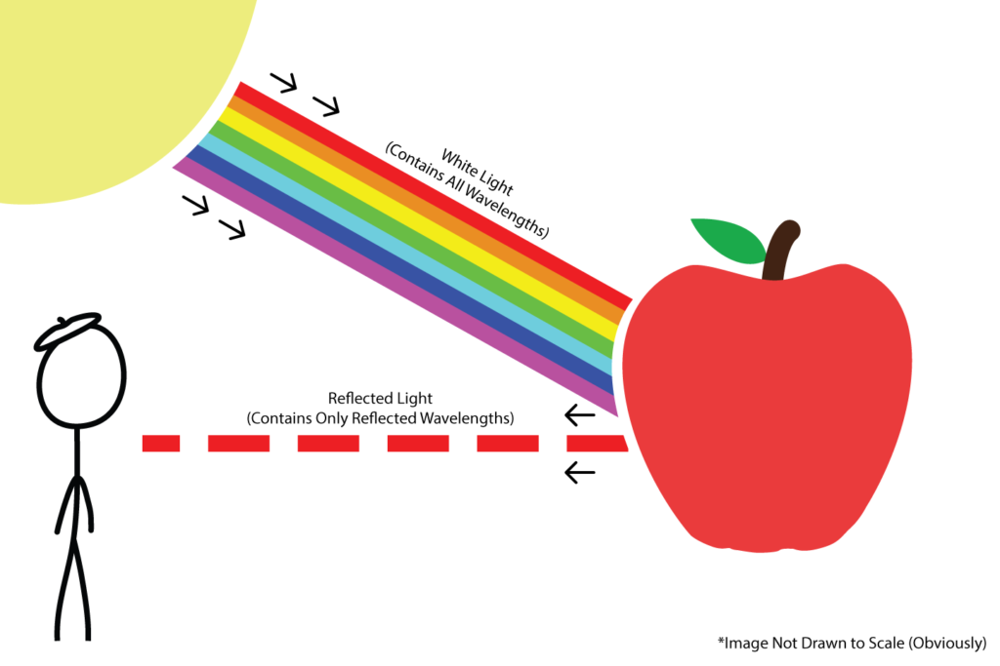

# Ray Tracing
Semestre 02, 2025

## Objetivo

Expandir el uso del concepto de un rayo para representar la realidad mejor en 2D y eventualmente en 3D.

## ¿Cómo vemos?

Los humanos percibimos la luz que llega a nuestros ojos luego de interactuar con múltiples objetos en el camino.

La luz blanca contiene todas las longitudes de onda.

Los objetos absorben y reflejan diferentes longitudes de onda.

El color que vemos es el resultado de la luz reflejada que llega a nuestros ojos.

## Rayos 3D

Queremos replicar el comportamiento de la luz en un entorno 3D

- Los rayos salen de la fuente de luz.
- Impactan en objetos y se reflejan en todas direcciones.
- Una parte de esos rayos llega a nuestros ojos.

**Problema:**  

El número de rayos posibles es prácticamente infinito, lo que hace imposible simularlos todos.

**Solución:**

En lugar de lanzar rayos desde la luz hacia los objetos, lanzamos rayos desde la cámara (nuestro punto de vista) hacia la escena.

- Cada rayo recorre el espacio hasta encontrar un objeto o llegar al infinito.
- En cada intersección, calculamos el color resultante.
- Este proceso se repite **un rayo por cada píxel** de la imagen.

## Rayos primarios y secundarios

**Rayos primarios:** salen desde la cámara hacia la escena.

**Rayos de sombra:** se lanzan desde el punto de intersección hacia las luces para determinar iluminación.

**Rayos reflejados/refractados:** simulan materiales como espejos, vidrio o agua.

## Construyendo la imagen

La combinación de todos los rayos genera la imagen final.

Es una proyección de alta definición sin transformaciones geométricas.

Conceptualmente, es un **cíclo doble** que recorre todos los píxeles.

## Normalización de direcciones

Para lanzar un rayo necesitamos definir su dirección en un sistema de coordenadas que sea consistente y fácil de manejar matemáticamente.

Esto se hace en un espacio de coordenadas normalizado, donde todos los valores se expresan en un rango y escala conocida.

Las pantallas usan coordenadas **de píxel** con un origen en la esquina (0,0) y valores positivos hacia la derecha (x) y hacia abajo (y).

Si trabajáramos directamente en ese espacio, los cálculos de intersecciones y proyecciones dependerían del tamaño exacto de la ventana lo que no es reutilizable.

Al mapear los píxeles a un rango [-1, 1] en X e Y, creamos un sistema independiente de la resolución.

Podemos cambiar la resolución sin alterar la lógica matemática del trazado de rayos

## Aspect Ratio

La mayoría de las pantallas no son cuadradas, así que el eje X debe escalarse para que los rayos se proyecten con la geometría correcta.

Si no se ajusta el aspect ratio, un círculo podría verse como una elipse estirada horizontalmente o verticalmente.

$ratio = \frac{ancho}{alto}$

Multiplicamos la coordenada X por este factor antes de normalizar.

Evita que la imagen se estire o comprima horizontal o verticalmente.

## Logitud Unitaria

Aplicamos normalización para que todos los rayos tengan longitud unitaria.

Una dirección en 3D se representa como un vector, si ese vector tiene una longitud arbitraria, la magnitud podría distorsionar el resultado.

Normalizar significa dividir el vector por su propia longitud:

$\vec{d}_{norm} = \frac{\vec{d}}{\|\vec{d}\|}$

## Luz difusa y especular

En gráficos por computadora, la interacción entre la luz y la superficie de un objeto se modela usando diferentes componentes de iluminación. Las dos más comunes son difusa y especular.

### Luz Difusa

Representa la forma en que la luz se dispersa uniformemente en todas las direcciones después de chocar sobre una superficie rugosa o mate.

La intensidad de la luz difusa depende únicamente del ángulo entre la luz y la normal de la superficie, no de la posición del observador.

### Luz Especular

Representa la luz que se refleja de forma más concentrada en una dirección específica, típica de superficies lisas o pulidas.

La intensidad especular sí depende de la posición del observador.

Es un reflejo, o brillo.

La combinación de ambos modelos genera realismo.

## Objetos y materiales

En ray tracing, los objetos y materiales definen qué forma tiene el mundo y cómo responde a la luz.

Para calcular intersecciones necesitamos 2 factores:

- **Geometría:** Esferas, planos, triángulos.
- **Materiales:** Definen cómo se comporta la luz (difusa, especular, translúcida).

