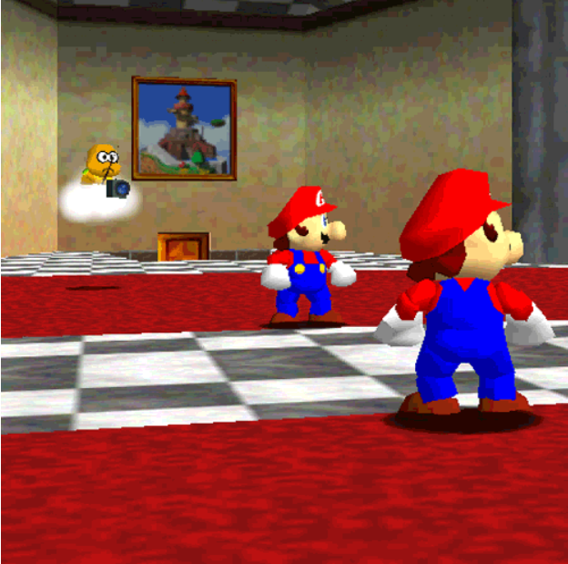
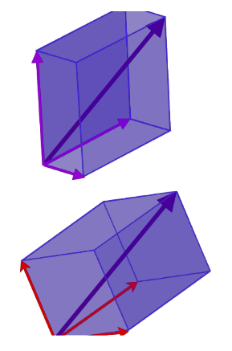
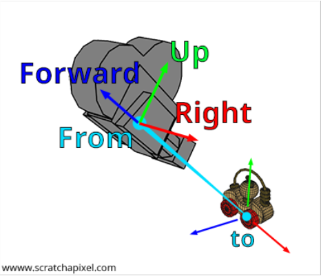
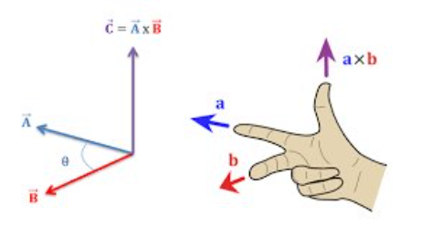
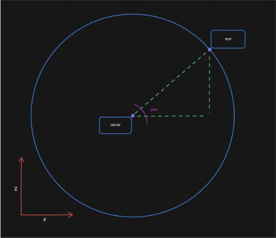
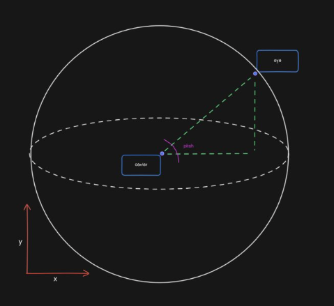
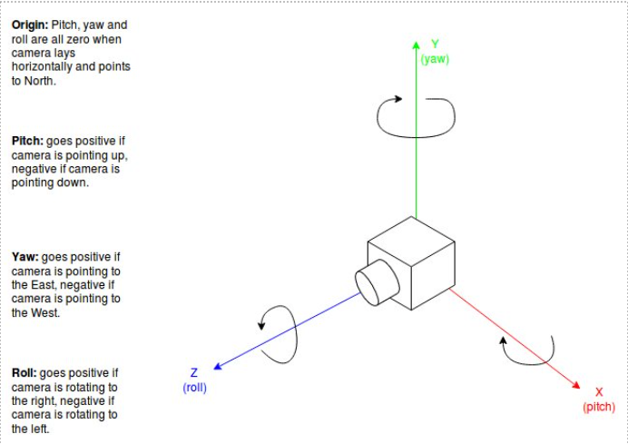

# Orbit Camera
Semestre 02, 2025


## Introducción


Existen 2 tipos de cámaras con los que podemos trabajar.


### Free cam
- Primera persona.
- Google Earth
- Similar al Ray Caster.


### 3rd Person

- Sigue al personaje principal
- Lakitu




## Definición


Rota alrededor de un punto objetivo manteniendo una distancia fija (radio).


Muy usada en editores 3D y vistas en tercera persona.


El movimiento está restringido a la superficie de una esfera alrededor del objetivo.


Similar a la orbita de la tierra al rededor del sol.


## Definición


Se compone de 3 valores:


**Eye**: posición de la cámara en el mundo.


**Center**: punto objetivo. Lo que ve la cámara. Mario.


**Up**: vector que indica la dirección "arriba".


El uso de vectores es clave ya que hace más fácil que la contra parte que sería usar ángulos.


Con ellos podemos aplicar operaciones entre ellos mismos para encontrar y calcular valores de interés.


## Proyecciones


El proceso en el que vamos a convertir una escena de 2D a 3D.


Vamos a utilizar cambios de base para lograr cenvertir nuestra escena.


Cambiar el sistema de coordenadas de nuestros vectores.


Todo lo vamos a hacer en base a la perspectiva de la cámera.


El vector morado no ha cambiado, solo el espacio en el que existe.




El objetivo es determinar los valores de la nueva base que no debería de ser un problema de matemática.


Estas nuevas coordenadas deben ser relativas a la posición de la cámara.




## Ejes


Vamos a buscar los valores de los 3 ejes vamos a calcular la nueva base.


### Eje Z


Es el valor más fácil de calcular


Se obtine restando **CENTER** y **EYE**.


Este valor es negativo lo que indica que la cámara se aleja del objetivo.


### Eje X


Regla de la mano derecha




Se calcula haciendo producto cruz entre el **Eje Z** y **UP**.


### Eje Y


Regla de la mano derecha


Se calcula haciendo producto cruz entre el **Eje Z** y el **Eje X**


Al obtener estos 3 valores procedemos a realizar multiplicaciones para encontrar la nueva base.


Siempre recordando normalizar.


### Chivo

- Eje $Z$ (Forward): 
$\text{normalize}(\text{center} - \text{eye})$  

- Eje $X$ (Right): 
$\text{normalize}(\text{cross}(z, \text{up}))$  

- Eje $Y$ (UP): 
$\text{cross}(x, z)$  


## Movimiento


Para agregar realismo a nuestras escenas vamos a agregar movimiento.


En este caso el movimiento será desde la cámara.


Usaremos ángulos de Euler. Describen la orientación de un objeto en un espacio 3D mediante rotaciones en los 3 ejes.


Siempre en radianes.


### Yaw


Rotación de la cámara sobre el eje Y.


Si imaginamos la escena top-down podemos ver que el movimiento es una órbita.




Desde ese punto de vista el movimiento será en los ejes X y Z.


Para caulcular el valor debemos de saber qué es el radio. En este caso es la magnitud del vector desde el centro (objetivo) y eye (cámara).


Lo que se puede representar como el arcotangente de Z/X.


Simplificando al usar Atan2(radio.z, radio.x)


### Pitch


Rotación en el eje Z.


X es horizontal, Y es vertical y Z se aleja.


Esta órbita se vuelve una esfera.




El cateto adjacente no es precisamente todo el eje X


Podemos hacer Asin(radio.y / radio)


### Roll


Rotación sobre el eje X. En este curso no lo vamos a volver a mencionar. ⚰️





### Clamping


Debido a que es posible pasarse en los valores del Yaw debemos hacer un módulo para encontrar el valor correcto.​


350 grados + 20 grados = 370 grados​ ☠️


¿En qué juego nos podemos mover 360 grados en la vertical? por lo general está limitado a 90 grados hacia arriba y -90 hacia abajo.


## Conversión Esféricas a Cartesianas


Hasta el momento usamos coordenadas esféricas pero ahora debemos convertir a coordenadas cartesianas.


```
x = r * cos(φ) * cos(θ)
y = r * sin(φ)
z = r * cos(φ) * sin(θ)
```

* `r`: radio, `θ`: yaw, `φ`: pitch.
* Se suman al punto objetivo para obtener la posición de la cámara.