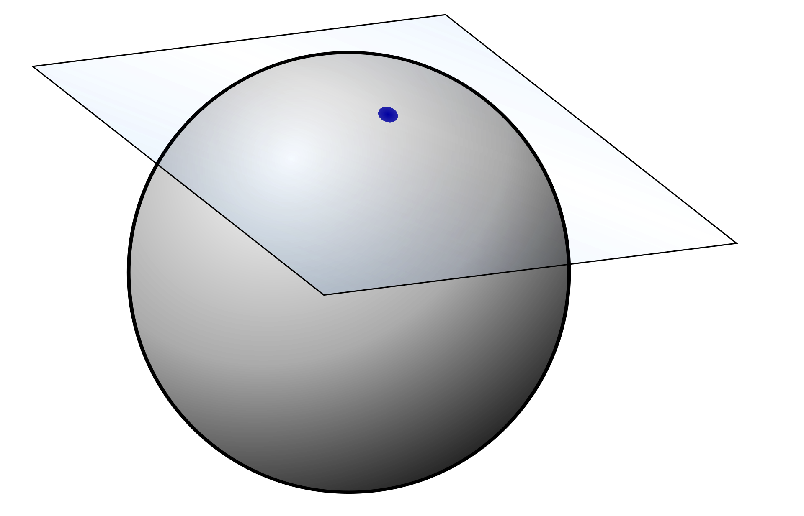
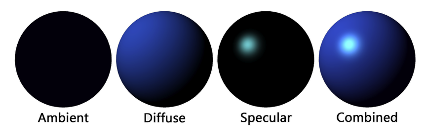
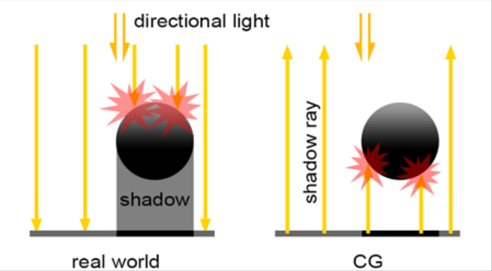
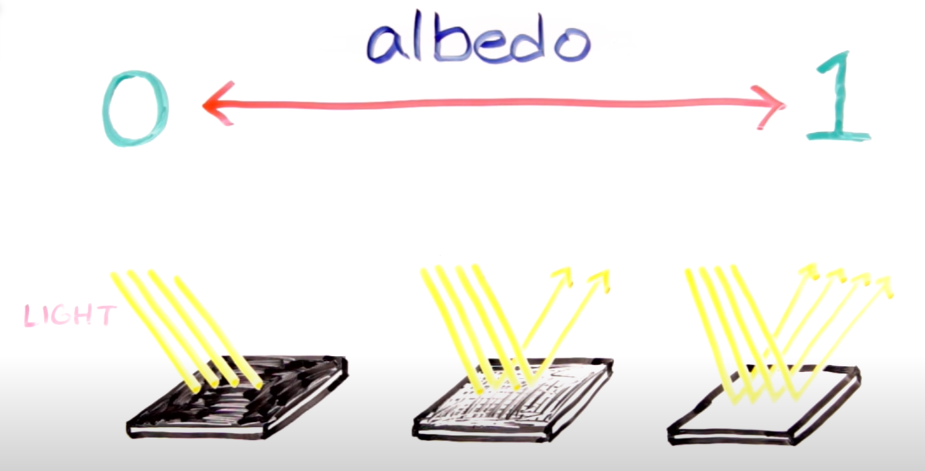
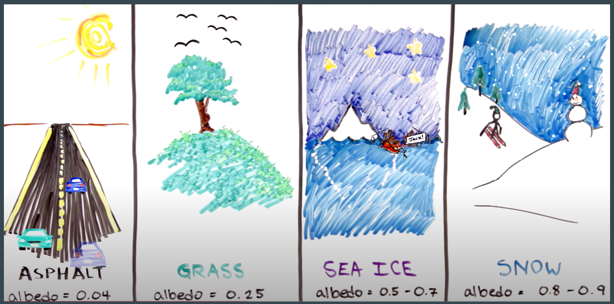

# Normales
Semestre 02, 2025

## Introducción

En el renderizado buscamos simular cómo la luz interactúa con las superficies. Para ello necesitamos tres elementos clave.

- **Normales**: orientación de la superficie.
- **Luz**: energía que incide.
- **Modelo de iluminación (Phong)**: fórmula que combina luz, color y material.

## Normales

Una **normal** es un vector perpendicular a la superficie en un punto.  

Define cómo se orienta una superficie respecto a la luz, la cámara y otros objetos.

Determinan **cómo la luz incide** en un objeto.

Se utilizan para calcular:
  - **Sombras** (si la superficie mira hacia la luz o no).
  - **Brillos especulares** (cuánto refleja hacia la cámara).
  - **Iluminación difusa** (qué tan iluminado se ve un punto).

Permiten simular materiales realistas.

Siempre tiene **longitud 1** (se normaliza).

Siempre es **perpendicular** a la superficie local.

## Luz

La **luz** en gráficos por computadora es esencial para simular cómo los objetos se ven en una escena.

Sin luz, los objetos serían invisibles: la luz define colores, sombras, reflejos y el ambiente general de la imagen.

### Tipos principales de luz

1. **Luz direccional**  
   - Representa fuentes de luz muy lejanas, como el sol.  
   - Sus rayos llegan en paralelo a toda la escena.  
   - No se atenúa con la distancia. 

   Ejemplo: un amanecer donde todo recibe luz del mismo ángulo.

2. **Luz puntual**  
   - Se comporta como una bombilla o una vela.  
   - Emerge de un punto en el espacio y se propaga en todas las direcciones.  
   - La intensidad disminuye con la distancia (atenuación).  

### Propiedades de la luz

- **Color**: define el tono de la luz (ej. luz cálida amarilla, luz fría azulada).  

- **Intensidad**: qué tan fuerte ilumina (factor multiplicador en la ecuación de iluminación).  

Estas propiedades influyen en la forma en que interactúan con el material de los objetos.

Al calcular iluminación en un punto de intersección, necesitamos:  
- La **normal** de la superficie en ese punto.  
- La **dirección de la luz**.  
- La **dirección hacia la cámara**.  

## Albedo

El **albedo** es una propiedad de los materiales.  

Define el **color base** o intrínseco de la superficie, **independiente de la luz** que la ilumina.

Es la fracción de luz que un material refleja de manera **difusa**.  

No depende de la dirección de la luz ni de la cámara, sino del propio material.  

Se expresa comúnmente como un color RGB.

Ejemplo:  
- Una esfera roja tiene un albedo rojo.  
- Una hoja verde tiene un albedo verde.  

Cuando aplicamos un modelo de iluminación (como Lambert o Phong), el albedo se combina con la luz:  

$$
Color_{final} = Albedo \times Luz
$$

Si el albedo es rojo y la luz es blanca → el objeto se ve rojo brillante.  

Si el albedo es rojo y la luz es azul → el objeto se ve oscuro, ya que apenas refleja la componente azul.  

## Phong

El **modelo de iluminación de Phong** es uno de los más populares para simular cómo la luz interactúa con una superficie.  

Su objetivo es obtener un color realista combinando varios componentes de luz.

### Fórmula general

$$
I = I_a + I_d + I_s
$$

Donde:
- $I$ = intensidad total de la luz en un punto.  
- $I_a$ = componente **ambiente**.  
- $I_d$ = componente **difusa**.  
- $I_s$ = componente **especular**.  

### 1. Componente Ambiente ($I_a$)

- Representa la **iluminación mínima** de la escena.  
- Simula la luz indirecta que se refleja en todas partes (aunque no haya una fuente de luz directa).  
- Sin esta componente, las superficies en sombra serían completamente negras.  

$$
I_a = k_a I_{amb}
$$

- $k_a$ = coeficiente ambiental del material.  
- $I_{amb}$ = intensidad de la luz ambiente en la escena.  

### 2. Componente Difusa ($I_d$)

- Depende del **ángulo entre la luz y la normal** de la superficie.  
- Se basa en la **Ley de Lambert**: la intensidad es máxima cuando la luz incide perpendicular a la superficie.  

$$
I_d = k_d (\mathbf{L} \cdot \mathbf{N}) I_{luz}
$$

- $k_d$ = coeficiente difuso (color base o **albedo**).  
- $\mathbf{L}$ = vector unitario hacia la luz.  
- $\mathbf{N}$ = normal de la superficie.  
- $\mathbf{L} \cdot \mathbf{N}$ = producto punto, mide el coseno del ángulo.  

Si $\mathbf{L} \cdot \mathbf{N} < 0$, la luz no llega a la superficie (queda en sombra).  

### 3. Componente Especular ($I_s$)

- Simula el **brillo o reflejo** en la superficie.  
- Depende de la dirección en la que el observador ve el objeto.  
- Se produce cuando el ángulo de reflexión coincide con la dirección de la cámara.  

$$
I_s = k_s (\mathbf{R} \cdot \mathbf{V})^n I_{luz}
$$

- $k_s$ = coeficiente especular del material.  
- $\mathbf{R}$ = vector de reflexión de la luz respecto a la normal.  
- $\mathbf{V}$ = vector hacia el observador (cámara).  
- $n$ = exponente de brillo (shininess):  
  - $n$ bajo → superficie mate.  
  - $n$ alto → reflejo muy concentrado (plástico, metal).  

## Aplicado en un Ray Tracer

1. Intersección del rayo con un objeto.
2. Calcular normal.
3. Aplicar albedo.
4. Usar Phong con la luz.
5. Escribir color en el framebuffer.
