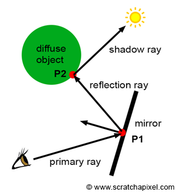
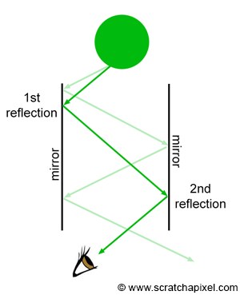
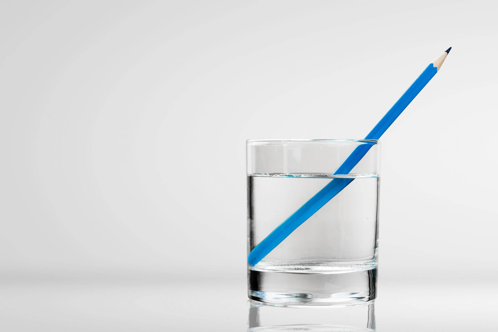
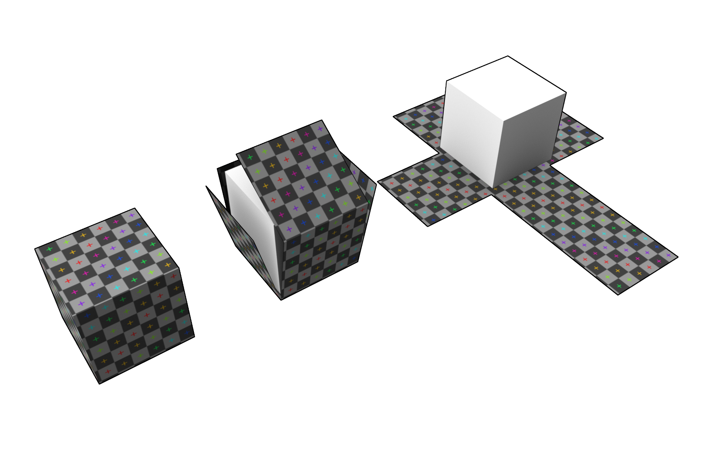
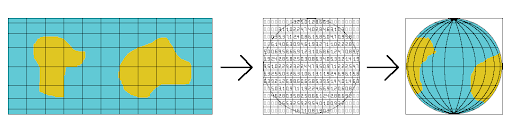

# Reflexiones, Refracciones y Texturas
Semestre 02, 2025

## Introducción

En nuestras escenas no basta con simular la iluminación directa. Para lograr imágenes realistas, necesitamos incorporar fenómenos ópticos adicionales:

**Reflexiones**: cómo la luz rebota en superficies.

**Refracciones**: cómo la luz se curva al atravesar materiales transparentes.

**Texturas**: cómo aplicar detalles visuales a los objetos para enriquecer su apariencia.

## Reflexiones

La **reflexión** ocurre cuando un rayo de luz incide sobre una superficie y rebota en una nueva dirección.

### Tipos de reflexión

1. **Especular**

   * Como en un espejo.
   * El ángulo de incidencia es igual al ángulo de reflexión.
   * Refleja detalles nítidos de la escena.

2. **Difusa**

   * La luz se dispersa en múltiples direcciones.
   * Superficies rugosas o mates.
   * Se modela mejor con el término **difuso de Lambert/Phong**.

En un **ray tracer**, el interés principal es la **reflexión especular**: calcular hacia dónde viaja el rayo reflejado para simular espejos, agua, metales y plásticos brillantes.

### Cálculo del vector reflejado

$$
\mathbf{R} = \mathbf{I} - 2 (\mathbf{I} \cdot \mathbf{N}) \mathbf{N}
$$

* \$\mathbf{I}\$ = vector incidente (dirección del rayo entrante, normalizado).
* \$\mathbf{N}\$ = normal de la superficie en el punto de intersección.
* \$\mathbf{R}\$ = vector reflejado (dirección del nuevo rayo).

### Control de la recursión

Para evitar cálculos infinitos (ej. dos espejos enfrentados), se define una **profundidad máxima de reflexión** (`max_depth`).

Cada vez que un rayo reflejado se dispara, se reduce el contador de profundidad.

Si llega a 0, ya no se generan más reflexiones.

### Materiales reflectantes parciales

No todos los materiales reflejan el 100% de la luz.

* Un **espejo ideal**: reflejo completo.
* Un **metal pulido**: mezcla de reflexión especular + color del material.
* Un **plástico**: reflexión especular reducida + iluminación difusa.

En la práctica, esto se logra mezclando el **color local (Phong + albedo)** con el **color reflejado**:

$$
Color_{final} = (1 - k_r) \cdot Color_{local} + k_r \cdot Color_{reflejado}
$$

* \$k\_r\$ = coeficiente de reflexión (0 = mate, 1 = espejo ideal).

### Aplicación en un Ray Tracer

1. Intersección con el objeto.
2. Calcular la normal.
3. Generar un nuevo rayo reflejado \$\mathbf{R}\$.
4. Volver a evaluar la iluminación en esa dirección.
5. Combinar el resultado con el color original.

## Refracciones

La **refracción** ocurre cuando la luz atraviesa un material transparente o translúcido (vidrio, agua, hielo).

La dirección del rayo cambia por la diferencia de índices de refracción entre medios, descrita por la **Ley de Snell**.

### Ley de Snell

$$
n_1 \sin\theta_1 = n_2 \sin\theta_2
$$

* \$n\_1\$: índice del medio de **entrada**.
* \$n\_2\$: índice del medio de **salida**.
* \$\theta\_1\$: ángulo de **incidencia**.
* \$\theta\_2\$: ángulo de **refracción**.

En materiales típicos: aire \$\approx 1.0\$, agua \$\approx 1.33\$, vidrio \$\approx 1.5\$.

### Cálculo del vector refractado

$$
\mathbf{T} = \eta \mathbf{I} + (\eta (\mathbf{I} \cdot \mathbf{N}) - \sqrt{1 - \eta^2 (1 - (\mathbf{I} \cdot \mathbf{N})^2)}) \mathbf{N}
$$

* \$\mathbf{I}\$ = vector incidente.
* \$\mathbf{N}\$ = normal en el punto de intersección.
* \$\eta = \tfrac{n\_1}{n\_2}\$ = relación de índices.
* \$\mathbf{T}\$ = dirección del rayo transmitido.

### Reflexión total interna (RTI)

Si \$\theta\_1\$ es muy grande, el discriminante dentro de la raíz es negativo: no hay transmisión y el rayo **se refleja totalmente** (ej. agua → aire).

Si el valor bajo la raíz es < 0.

### Algoritmo

1. **Detectar si entra o sale** → usar el signo de \$\mathbf{I}\cdot\mathbf{N}\$ para decidir orientación de la normal.
2. **Escoger \$n\_1, n\_2\$** y calcular \$\eta\$.
3. **Comprobar RTI** → si ocurre, solo calcular reflexión.
4. **Calcular \$\mathbf{T}\$** con la fórmula.

5. Mezclar colores de reflexión y refracción según el ángulo.
6. **Disparar rayos secundarios** reflejado/refractado, con `max_depth` para limitar recursión.
7. **Escribir color final** en el framebuffer.

## Texturas

Una **textura** es una imagen 2D que se "envuelve" sobre una superficie 3D para añadir detalle visual. 

Permite que un objeto tenga patrones complejos (mármol, madera, metal, ladrillo) sin necesidad de modelar cada irregularidad en su geometría.

### Mapeo de texturas

El proceso de aplicar una textura se conoce como **mapeo UV**. Consiste en asociar cada punto de la superficie 3D con coordenadas 2D $(u, v)$ dentro de la imagen de textura.

* $u \in [0,1]$: coordenada horizontal.
* $v \in [0,1]$: coordenada vertical.

El color final de un punto en la superficie se obtiene al **muestrear** el píxel de la textura en esas coordenadas.

### Tipos de texturas

1. **Difusa (albedo)**: define el color base del material. Se multiplica con la luz para obtener el color final.

2. **Specular maps**: controlan qué áreas son brillantes (metal, plástico) y cuáles son mates.

3. **Normal maps**: modifican las normales para simular relieve sin añadir geometría.

4. **Bump maps**: alteran la iluminación para aparentar rugosidad.

5. **Displacement maps**: a diferencia de los bump/normal, sí modifican la geometría desplazando vértices.

### Flujo típico en el ray tracer:

1. **Intersección del rayo** con el objeto (ej. esfera, plano).

2. El objeto calcula sus coordenadas de textura $(u, v)$:

   * En esferas: se usa la posición en coordenadas esféricas para obtener $u, v$.

3. **Consulta de la textura** en esas coordenadas:
   Sacamos un `sample` que devuelve el color de la imagen en $(u, v)$.

4. Ese color se combina con el modelo de iluminación (Phong).

5. Se escribe el resultado en el framebuffer.
