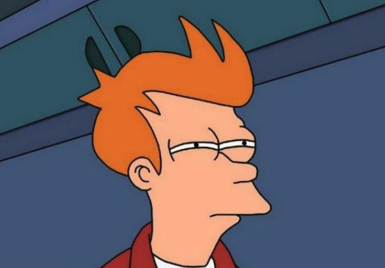

# Render Pipeline
Semestre 02, 2025

## Introducción

El **Render Pipeline** es el conjunto de pasos que transforma una escena 3D en una imagen 2D en la pantalla. 

¿Otra vez? pero ¿y el Ray Tracer?

El Render Pipeline es un atajo optimizado para dibujar 3D en 2D de forma rápida.

El Ray Tracer es una simulación física de la luz, más precisa pero más lenta. 

Es la “línea de ensamblaje” de los gráficos por computadora.

Divide el proceso en **etapas secuenciales**.

Algunas etapas son **programables** (shaders), otras son **fijas** (hardware).

Permite entender **qué ocurre con los datos** desde que definimos vértices hasta que vemos píxeles encendidos.

## Usos

Convertir geometría + materiales + cámara → imagen visible.

Aplicar transformaciones geométricas (mover, rotar, escalar, proyectar).

Simular la interacción de la luz con los materiales.

Integrar efectos visuales (sombras, reflejos, transparencia).

Optimizar para tiempo real (videojuegos) o para calidad máxima (render offline).

Es la receta completa para dibujar el mundo virtual en la pantalla.

## Etapas

1. **Aplicación (CPU)**
   - Prepara la escena y envía datos a la GPU.
   - Define la cámara, los modelos y las luces.

2. **Procesamiento de Vértices (Vertex Shader)**
   - Toma cada vértice y lo transforma de su espacio local hasta el **clip space**.
   - Calcula posiciones y pasa atributos (color, normales, coordenadas UV).

3. **Ensamblado de primitivas, Clipping y Transformaciones**
   - Agrupa vértices en triángulos/líneas.
   - Recorta contra el volumen de vista.
   - Realiza el **perspective divide** y el mapeo al viewport.

4. **Rasterización**
   - Convierte las primitivas en fragmentos (candidatos a píxeles).
   - Interpola atributos entre vértices.

5. **Procesamiento de Fragmentos (Fragment Shader)**
   - Calcula el color de cada fragmento.
   - Aplica texturas, iluminación, efectos.

6. **Operaciones por-fragmento y Framebuffer**
   - Depth test, stencil test, blending.
   - Resultado final se escribe en la pantalla.

## Primera etapa: Aplicación (CPU)

- Se ejecuta en el procesador principal.

- Prepara **todos los datos de entrada**:
  - Vértices de los modelos.
  - Transformaciones de cada objeto.
  - Posición y orientación de la cámara.
  - Parámetros globales (uniforms).

- Envía esta información a la **GPU** mediante llamadas a la API gráfica (OpenGL, DirectX, Vulkan).

## Vertex Shader

El **Vertex Shader** es el primer paso programable de la GPU.

- Entrada: un vértice con sus atributos (posición, color, normal, UV).

- Operaciones principales:
  1. **Transformación de modelo**: lleva el vértice de coordenadas locales a coordenadas de mundo.
  2. **Transformación de vista**: coloca el sistema de coordenadas según la cámara.
  3. **Transformación de proyección**: aplica perspectiva o proyección ortográfica.
  4. **Clip space**: salida lista para ser recortada y proyectada.

- Salida: `gl_Position` (posición en clip space) + atributos que seguirán hacia el fragment shader.

## Primitive Assembly

- La GPU agrupa vértices según el modo de dibujo (`GL_TRIANGLES`, `GL_LINES`, `GL_POINTS`).

- Conecta cada vértice en **primitivas** básicas.

- Ejemplo:
  - 3 vértices → 1 triángulo.
  - 2 vértices → 1 línea.

Se empiezan a formar modelos

## Clipping y Transformaciones

1. **Clipping**
   - Se eliminan las partes de las primitivas que quedan fuera del volumen de vista.
   - Esto evita dibujar lo que no sería visible.

2. **Perspective divide**
   - Convierte de coordenadas homogéneas `(x, y, z, w)` a coordenadas normalizadas `(x/w, y/w, z/w)`.
   - Es lo que crea el efecto de perspectiva.

3. **Viewport transform**
   - Escala las coordenadas normalizadas a coordenadas de ventana (píxeles reales en la pantalla).

## Rasterización

Convierte cada **primitiva** en un conjunto de **fragmentos**.

Un fragmento corresponde a un “candidato a píxel”.

Se calculan atributos por interpolación:
  - Coordenadas UV.
  - Normales.
  - Colores.

Cada fragmento pasará al siguiente paso para determinar su color final.

## Fragment Shader

- Entrada: fragmentos con atributos interpolados.

- Operaciones principales:
  - Aplicar **texturas** (muestreo de imágenes).
  - Calcular **iluminación** (Phong).
  - Añadir **efectos**: sombras, transparencias, reflejos.

- Salida: un color (vec4 RGBA) que se envía a la etapa final.

Se aplican efectos para realismo: materiales, luces, realismo.

## Operaciones por-fragmento

Antes de escribir en el framebuffer, cada fragmento pasa por pruebas:

- **Depth test**: determina si el fragmento está delante o detrás.

- **Stencil test**: permite máscaras y efectos avanzados.

- **Blending**: mezcla con el color que ya estaba en pantalla (ej. transparencias).

- Resultado final: solo los fragmentos válidos se escriben en el framebuffer.
